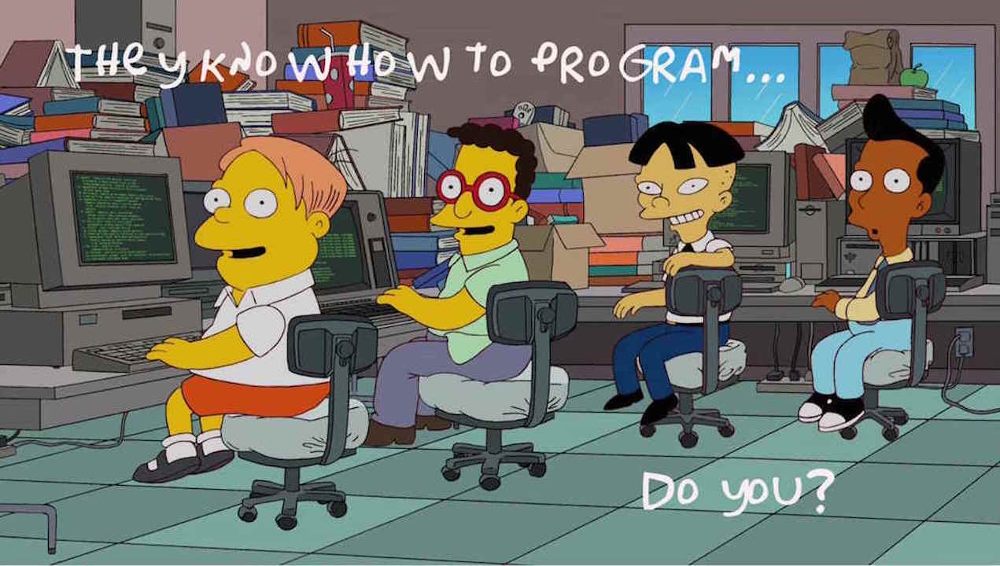
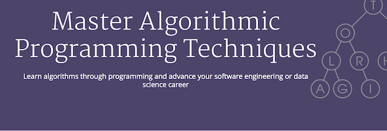
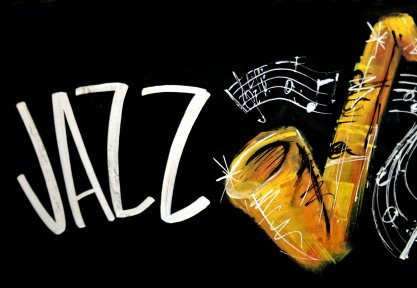

title: ACM-ICPC Si no tengo couch ¿por donde empiezo?
author:
  name: Julio César
  twitter: pazthor
  url: http://pazthor.me
output: index.html
style: style.css

--
###ICPC: si no tengo couch ¿Por donde empiezo?###
# 

--
### ¿Qué es ICPC?
- Concurso internacional universitario ACM  de programación(ACM - ICPC por sus siglas en inglés)
- 1 equipo de 3 integrantes  por universidad.
- Gana quien obtenga el mayor numero de problemas .
- Primera aparición en la Universidad A&M de Texas en 1970.
- Patrocinado por IBM

--
### ¿Coach? ¿para programar?###
# 
--
- Experiencia ( y se espera que pueda explicarla)
- Explica como trabajar
- Que estudiar
- Conoce su progreso.
- Los entrena...

--
### Propuesta
# 

--
### Paso 1
- Aclarar nuetros objetivos
- Organizate!
- mejorar nuestros métodos de estudio
- Planificar: hacer metas (alcanzables)
- Leer libros de comprensión de problemas (Desing thinking?)

--
###Apoyense de los cursos en linea
- [Master Algorithmic Programming Techniques](https://www.coursera.org/specializations/data-structures-algorithms)

# 

--
###Paso 2
- Leer(para empezar): Introduction to Algorithms, Thomas H. Cormen.
- Programar! Programar! Programar! ( _from scratch_ )
- marcar tus tiempos.
- Concursar en las rondas semanales de codeforces (div. 2)
- Concursar en HackerCup (de Facebook) y CodeJam( de Google)
- Aprender a trabajar en equipo
--
###Paso 3
- Entrar a concursos div 1 en [codeforces Contest](http://codeforces.com/contests)
- [topCoder](https://www.topcoder.com)
- Leer [Competitive Programming cpbook.net](http://cpbook.net/#downloads)

--
###Escuchen Jazz.
# 
